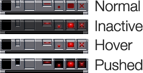
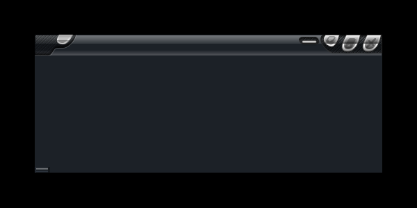

# rk-fluxbox-themes
A collection of my home-grown themes for [FluxBox, the light window manager for X](http://www.fluxbox.org/) (typically, \*Nix systems).

| MiniNES                          | Solipsist                          |
| -------------------------------- | ---------------------------------- |
|  |  |

# Using Source Aseprite Files

## Exporting all slices from an Aseprite file

- From Windows PowerShell
    - `& "D:\Program Files\SteamLibrary\steamapps\common\Aseprite\Aseprite.exe" -b .\tiled-theme-template.aseprite --split-slices --save-as 'demo-{slice}.png'`
    - The `&` at the start of the command is the Windows Powershell *Call Operator* to run commands stored in variables or path strings.
    - Also note the `.\` before the Aseprite theme file.
    - Had to wrap the output file in single quotes for it to work.
    - I frickin' hate Windows.

## Converting PNG images to XPM files

# Additional Notes
- [AntiX Linux](https://antixlinux.com/) apparently has an updated version of FluxBox that permits adding custom text-based buttons to the toolbar!
    - [antiX-forum: New Fluxbox available - How to add buttonts to its toolbar](https://www.antixforum.com/forums/topic/new-fluxbox-available/)
    - Note to self: add code examples inline here.
